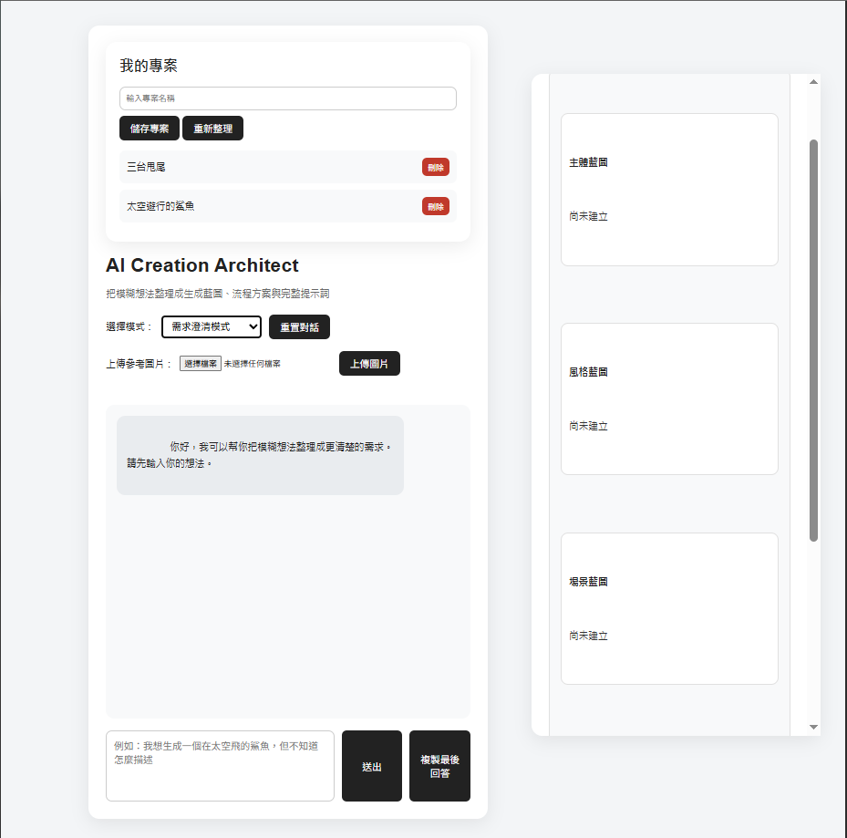

# AI Creation Architect



## 專案介紹

AI Creation Architect 是一個將模糊想法轉換成清楚需求、生成藍圖與完整提示詞的 AI 輔助系統。

本專案使用 Flask + Ollama + 本機 LLM 建立，支援多模式需求整理、圖片分析、Generation Blueprint、專案儲存與持續對話。

## 功能特色

- 多模式 AI 需求整理
- 需求澄清模式
- AI 顧問模式
- 圖片提示詞模式
- Vision AI 圖片分析
- Generation Blueprint 生成藍圖
- 主體藍圖 / 風格藍圖 / 場景藍圖 / 固定規則
- 專案儲存、載入、刪除
- 聊天紀錄保存
- 圖片上傳與專案同步
- 完整提示詞生成

## 使用技術

### Backend
- Python
- Flask

### AI Models
- Ollama
- Qwen3
- Qwen2.5-VL

### Frontend
- HTML
- CSS
- JavaScript

### Storage
- JSON
- Local File Storage

## 系統概念

使用者可以輸入模糊想法，系統會透過 AI 分析需求，整理成可執行的 Generation Blueprint。

圖片創作模式中，系統可以分析參考圖片，整理出主體、風格、場景與固定規則，並產生完整圖片生成提示詞。

## 系統流程

```text
使用者輸入文字 / 上傳圖片
        ↓
AI 需求理解引擎
        ↓
模式判斷
        ↓
AI 顧問模式 / 需求澄清模式 / 圖片提示詞模式
        ↓
多角色 AI 內部分析
        ↓
Generation Blueprint Engine
        ↓
主體藍圖 / 風格藍圖 / 場景藍圖 / 固定規則
        ↓
完整提示詞生成
        ↓
專案儲存 / 載入 / 刪除
        ↓
持續對話與需求更新

## 主要模式

### AI 顧問模式

適合自動化流程、系統規劃、工作流程整理。

### 需求澄清模式

適合使用者只有初步想法，需要 AI 協助整理需求。

### 圖片提示詞模式

適合 AI 圖片創作者，能建立生成藍圖並產生完整提示詞。

## Generation Blueprint

Generation Blueprint 是本專案的核心概念，分成：

- 主體藍圖
- 風格藍圖
- 場景藍圖
- 固定規則

這讓 AI 不只是生成文字，而是把模糊需求整理成可持續修改與保存的創作規格。

## 專案狀態

目前完成：

- Flask 網頁介面
- 多模式切換
- 本機 LLM 對話
- Vision AI 圖片分析
- 生成藍圖
- 專案管理
- 圖片上傳
- 完整提示詞生成

未來規劃：

- 圖片資料夾分析
- 多圖片共同風格分析
- Composition Blueprint 構圖藍圖
- 自動化流程 Blueprint
- 創業需求 Blueprint
- ComfyUI / Stable Diffusion 圖片生成整合
- 多模型協作

```markdown
## 未來開發流程

```text
圖片資料夾上傳
        ↓
Vision AI 多圖片分析
        ↓
共同風格特徵擷取
        ↓
風格 DNA / 角色 DNA
        ↓
Composition Blueprint 構圖藍圖
        ↓
ComfyUI / Stable Diffusion 圖片生成
        ↓
使用者回饋
        ↓
Blueprint 更新

## 安裝方式

### 1. 安裝套件

```bash
pip install -r requirements.txt

## 專案架構

```text
ai-creation-architect

│  app.py
│  ai_roles.py
│  README.md
│  requirements.txt
│  .env
│
├─engines
│  │ ai_engine.py
│  │ vision_engine.py
│  │ blueprint_engine.py
│  │
│  └─__init__.py
│
├─managers
│  │ project_manager.py
│  │
│  └─__init__.py
│
├─projects
│   └─ 儲存專案資料
│
├─templates
│   └─ index.html
│
└─static
    │ style.css
    │
    └─uploads
```

### 核心模組說明

#### app.py

Flask 主程式，負責路由、前後端溝通與系統整合。

#### ai_engine.py

AI 對話核心，負責需求分析、多角色協作與生成藍圖建立。

#### vision_engine.py

Vision AI 圖片分析模組，使用 Qwen2.5-VL 分析圖片內容。

#### blueprint_engine.py

Generation Blueprint 引擎，負責整理主體藍圖、風格藍圖、場景藍圖與固定規則。

#### project_manager.py

專案儲存、讀取、刪除與管理。

#### ai_roles.py

定義不同模式下的 AI 專家角色與工作內容。

```
```
